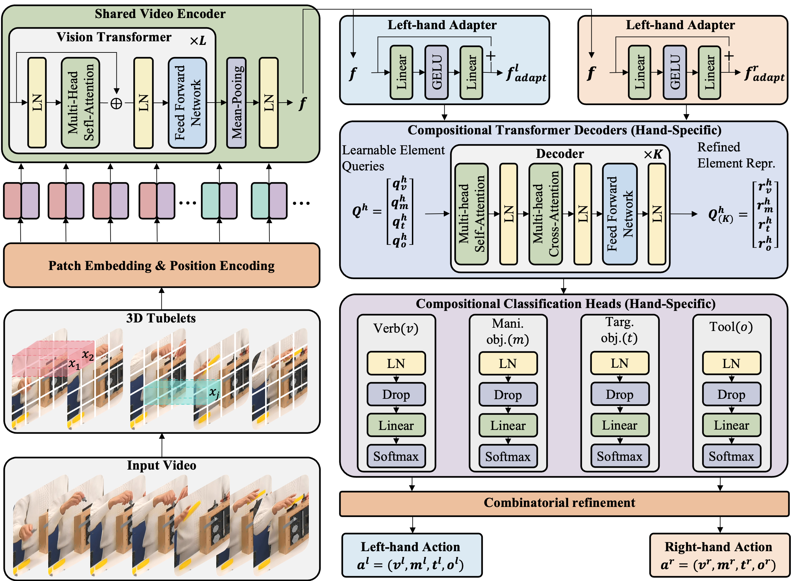
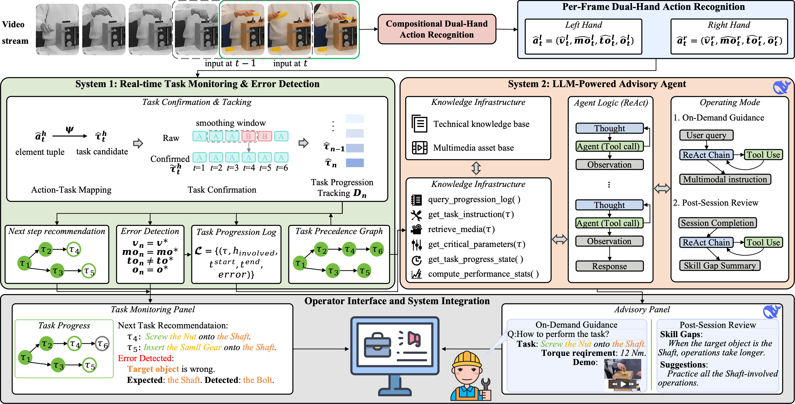
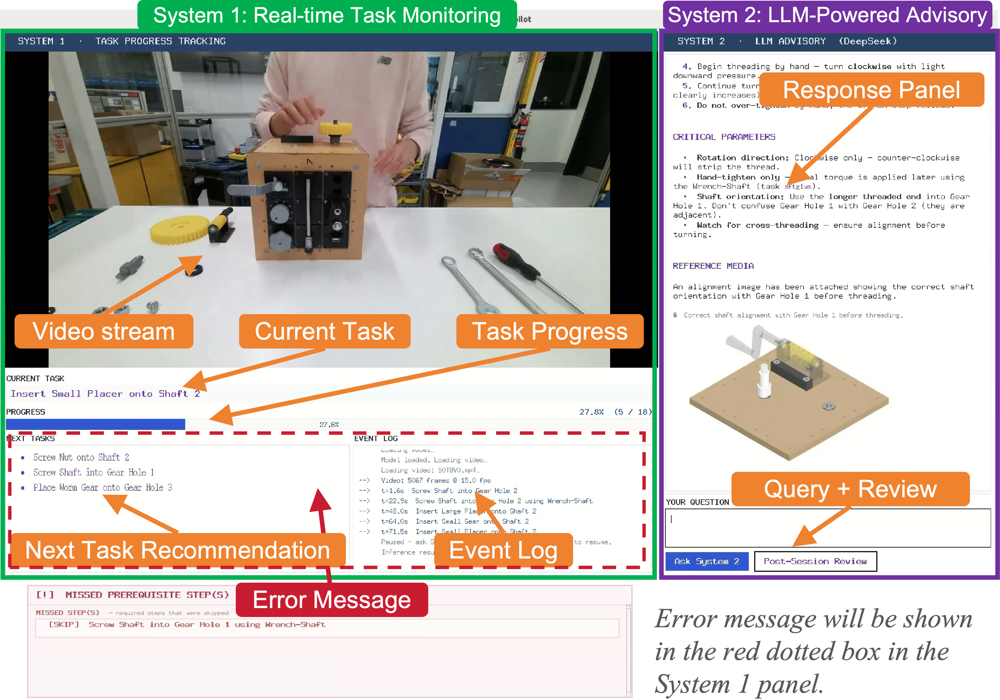

# CoDuAR and Assembly Copilot

Official repository for the paper:

**A Compositional Dual-Hand Action Recognition Method for an LLM-Driven Assembly Assistance**

## Overview

The project has two connected components:

- **CoDuAR**: compositional dual-hand action recognition, recognizing dual-hand actions simultaneously. Each hand is represented through action elements, including verb, manipulated object, target object, and tool.

<p align="center">
  
</p>

*CoDuAR decomposes dual-hand assembly actions into hand-specific compositional elements and refines their combinations for action recognition.*

- **Assembly Copilot**: a demonstration system showing how CoDuAR's compositional action representation can bridge real-time perception and language-based reasoning. A deterministic System 1, driven by CoDuAR, maps predictions to a symbolic task state for task tracking, next-step recommendation, and real-time error detection. An LLM-powered System 2 reasons over the symbolic state to answer operator queries and generate post-session performance reviews.

<p align="center">
  
</p>


*Assembly Copilot uses CoDuAR predictions as a symbolic bridge between real-time task monitoring and LLM-based advisory reasoning.*

## Repository structure

```text
.
├── assets/
│   ├── demo/                 # Demo video for the Assembly Copilot
│   └── figures/              # Paper figures
├── coduar/
│   ├── data/                 # HA-ViD and custom data preparation
│   ├── script/               # Training and evaluation scripts
│   ├── model/                # CoDuAR model implementation
│   └── README.md             # CoDuAR-specific training and evaluation instructions
├── assembly_copilot/
│   ├── asset/                # TPG, knowledge base, and multimedia assets
│   ├── script/               # GUI and demo launch scripts
│   ├── system2/              # LLM agent and tool definitions
│   └── README.md             # Assembly Copilot reproduction instructions
├── vlm_comparison/
│   ├── data/                 # Convert custom dataset to VLM JSON files
│   ├── config/               # LoRA fine-tuning configuration files
│   └── README.md             # VLM fine-tuning and evaluation instructions
├── requirements.txt          # Python dependencies
└── README.md                 # Repository-level overview
```

## Environment preparation

Create a Python environment from the repository root:

```bash
conda create -n coduar python=3.10 -y
conda activate coduar
pip install -r requirements.txt
```

## Reproducing the Work

This repository is organized so that each experimental component can be reproduced from the corresponding subfolder. The top-level README provides the overall project orientation, whereas the subfolder documentation should be treated as the authoritative source for executable commands, configuration files, dataset preparation, checkpoint placement, and evaluation protocols.

- **CoDuAR model training and evaluation**: refer to `coduar/` for preparing HA-ViD and custom dual-hand annotations, training the compositional action recognition model, running evaluation, and reporting the recognition results used in the paper.
- **Assembly Copilot demonstration**: refer to `assembly_copilot/` for reproducing the LLM-driven assistance workflow, including task-progress graph assets, symbolic state construction from CoDuAR predictions, GUI launch scripts, System 2 agent configuration, and the interactive demonstration protocol.
- **VLM comparison experiments**: refer to `vlm_comparison/` for converting the custom dataset into VLM-compatible JSON formats, configuring LoRA fine-tuning, evaluating VLM baselines, and comparing their performance with CoDuAR under the same experimental setting.

For reproducibility, readers should first install the shared dependencies above, then follow the README in the relevant subfolder. When reproducing the full paper pipeline, the recommended order is: prepare datasets in `coduar/`, train and evaluate CoDuAR, run the VLM comparison in `vlm_comparison/`, and finally launch the Assembly Copilot demonstration in `assembly_copilot/` using trained or exported CoDuAR predictions.


## Assembly Copilot Interface

<p align="center">
  
</p>


*The interface combines real-time task monitoring, progress tracking, next-task recommendation, error messages, and LLM-powered query/review support.*

## Demo

We provide a compressed demonstration video for the Assembly Copilot. Please find it in [`assets/demo`](assets/demo/demo480_24fps.mp4).

Here is a gif.


## Citation

If you use this repository, please cite the paper (BibTeX will be provided).

## License

This repository currently uses the MIT License.